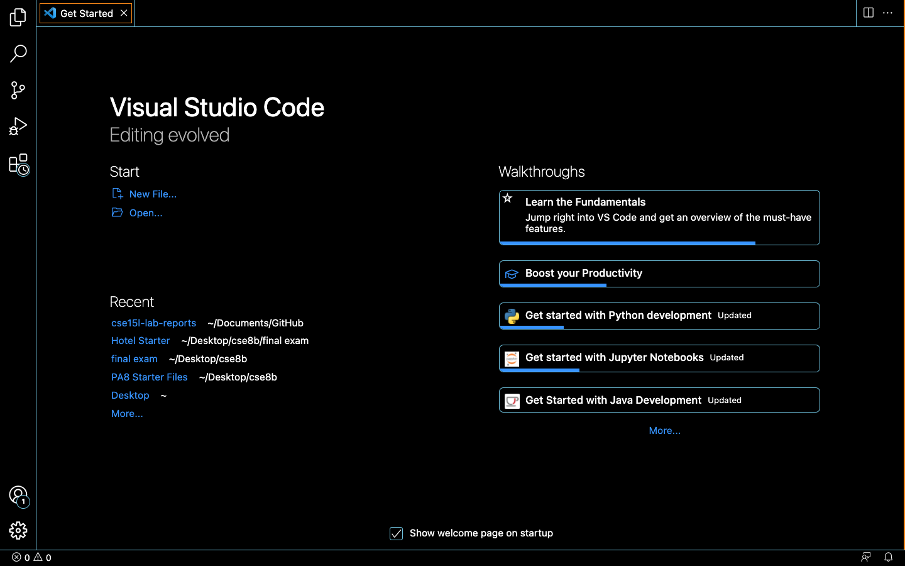
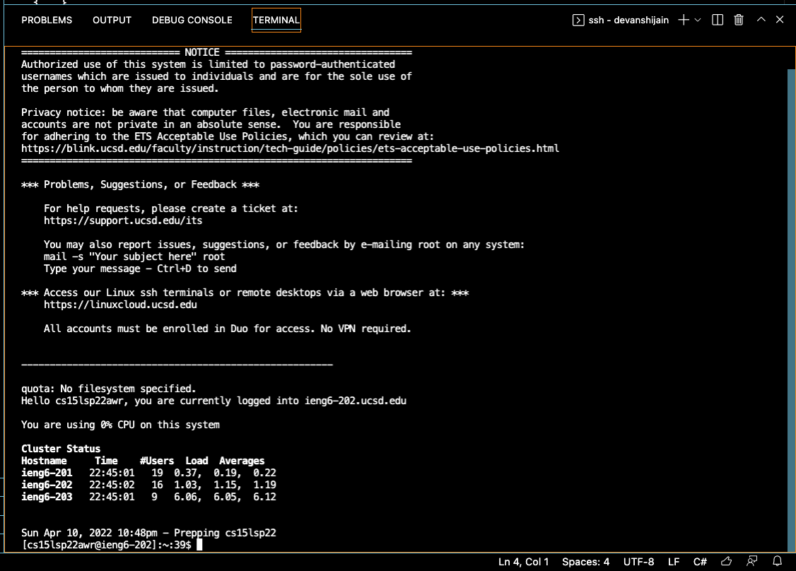
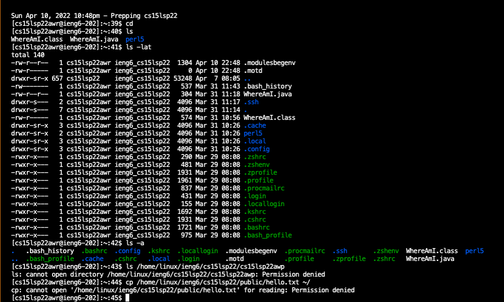
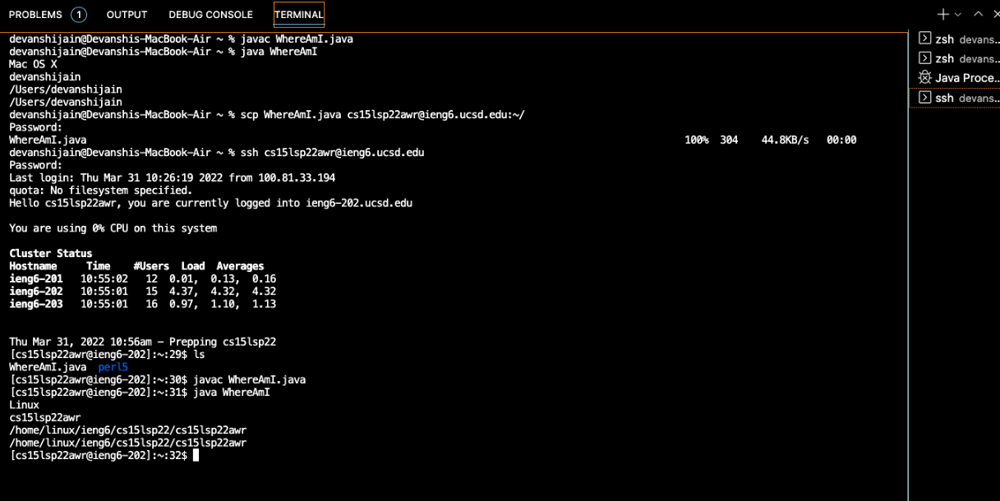
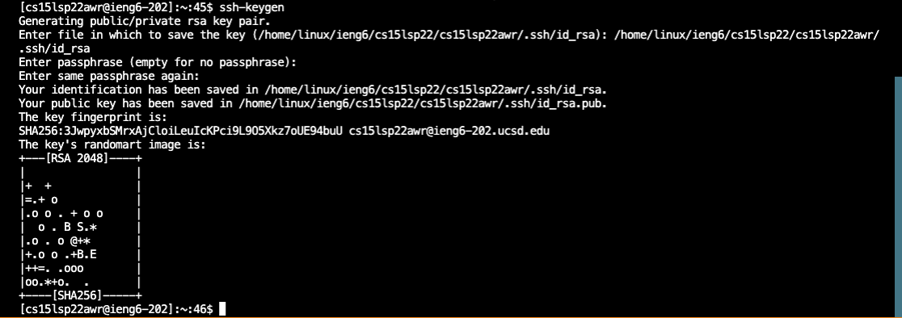
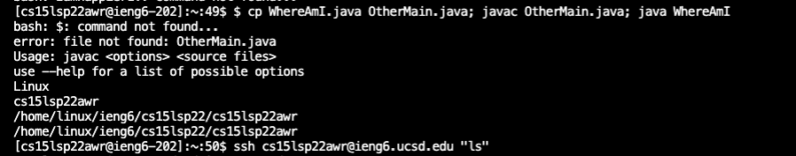

## Step-1: Installing VScode
Go to Visual Studio Code's website, https://code.visualstudio.com/, and follow the instructions to download and install it on your computer. 
Choose a version from OSX (for Macs) and Windows (for PCs). Finally when installed, you should be able to open a window that looks like this:


## Step-2: Remotely Connecting
In this section we learn how to use your machine to connect to a remote computer over the Internet to do work there.
In Visual Studio Code, we connect to the remote computer using VSCode’s remote option. First, open a terminal in VSCode (Ctrl + \`) followed by 
```$ ssh cs15lsp22awr@ieng6.ucsd.edu``` 
Since this is not the first time I’m running these commands, I connect to this server (here, a computer in the CSE basement), as evidenced below. Now, your computer is called the 'client' and the computer in the basement, the 'server' based on how you are connected.




## Step-3: Trying Some Commands
Try running the commands in different ways, both on your computer, and on the remote computer after ssh-ing. 
Here are some specific useful commands to try:
```
cd
ls -lat
ls -a
ls <directory> where <directory> is /home/linux/ieng6/cs15lsp22/cs15lsp22abc, where the abc is one of the other group members’ username
cp /home/linux/ieng6/cs15lsp22/public/hello.txt ~/
```

  
## Step-4: Moving Files with scp
One key step in working remotely is being able to copy files back and forth between the computers. A key way to copy file(s) from your computer to a remote computeris the command called ```scp```, and we run it from the client (your computer):
```scp WhereAmI.java cs15lsp22zz@ieng6.ucsd.edu:~/```
#### Note: 
while running the java file, the terminal shows name of the operating system we're using, name of the id, and file directories. When running on client, for a MacBook user, we get Mac OS X, while it is Linux on server. On client, my user id is devanshijain, while on server it is cs15lsp22awr. Similarly, the directory addresses change while on client and server respectively.



## Step-5: Setting an SSH Key
To avoid typing our password every time we log in or run scp, we use __ssh keys__. The _ssh-keygen_ program creates a pair of files called the public key, and the private key. After copying the public key to a particular location on the server, and the private key in a particular location on the client, the ssh command can use the pair of files in place of the password.


## Step-6: Optimizing Remote Running

We use different techniques to have the most pleasant process for making a local edit to a file, then copying it to the remote server and running it. One of such solutions involves combining different ways- for example, taking multiple commands separated by colons in a line. This command will log in and list the home directory on the remote server:
```$ ssh cs15lsp22zz@ieng6.ucsd.edu "ls"```
Here we use the ssh key to avoid typing in a password each time I log in or run scp.
```$ cp WhereAmI.java OtherMain.java; javac OtherMain.java; java WhereAmI```


created by __Devanshi Jain__


