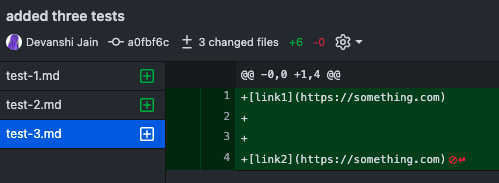
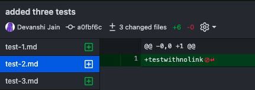
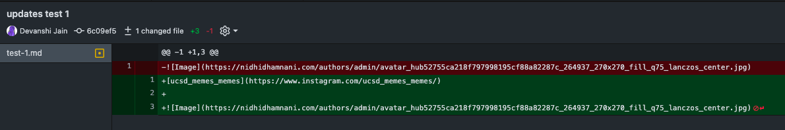
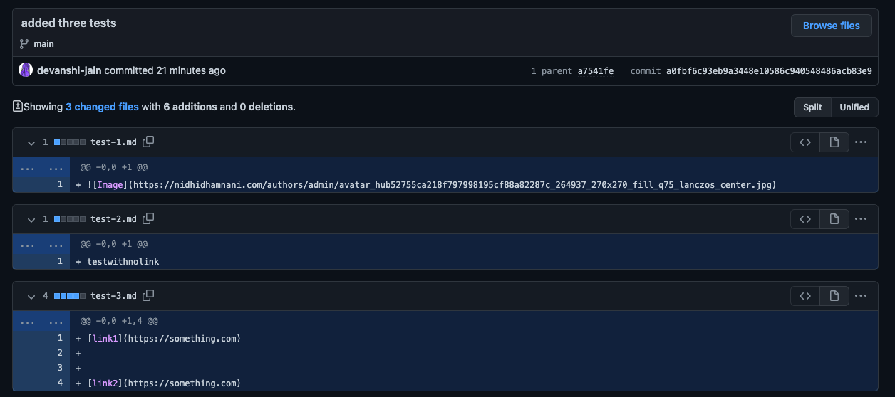

# Lab Report - 2

The given MarkdownParse.java file has been [updated](https://github.com/devanshi-jain/markdown-parser/commit/02373f3dc471ab4f032932a409d7e8aa380422e4), specifically the following code additions to take care of certain coundary cases have been made.
<br />
<br />
First, we try fixing the error that shows up when you leave a blank line betwen two links:

```
if (currentLine.length() == 0) continue;
            // Ensure that line isn't an image
```
Link to test-file : https://github.com/devanshi-jain/markdown-parser/blob/main/test-3.md
Symptom, i.e. output in commit history : 

For a test-file with no links, we try fixing it as follows.
```
if (args[0] == null) {
            throw new IOException("No file specified");
        }
```
Link to test-file : https://github.com/devanshi-jain/markdown-parser/blob/main/test-2.md
Symptom, i.e. output in commit history : 

Finally, to fix the bug which is when a file contains an image reference : 

```
if (currentLine.charAt(0) == '!') continue;
```
Link to test-file : https://github.com/devanshi-jain/markdown-parser/blob/main/test-1.md
Symptom, i.e. output in commit history : 

Finally, after pushing the updates version of MarkdownParse.java, we get the following: 


