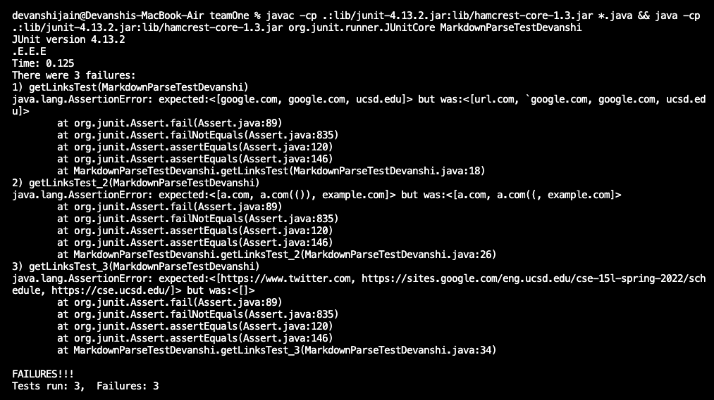
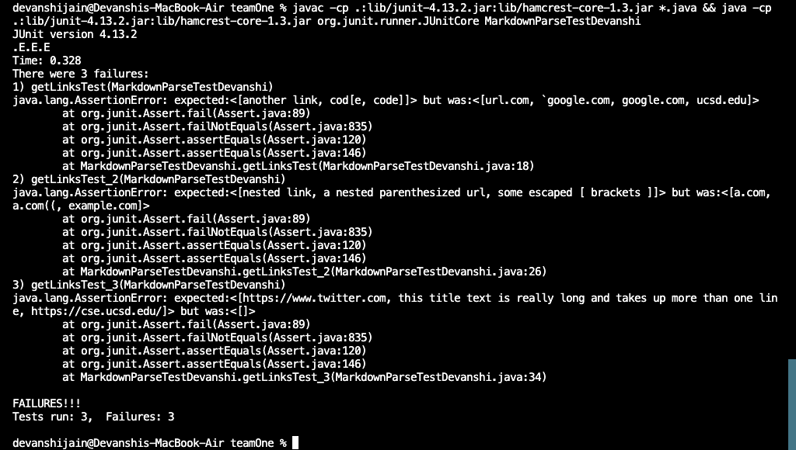

# Lab Report 4


Proceeded by adding three test methods in each MarkdownParse repository. 

1. Repository teamOne is a cloned repository corresponding to the collective github repository of our group : https://github.com/mv5903/markdown-parser
2. Repository teamTwo is the cloned repository of the group we reviewed : https://github.com/aHewig/markdown-parser

No, the corresponding output after running the JUnit test above, did not match the expected output, in our implementation.



No, the corresponding output after running the JUnit test above, did not match the expected output, in the implementation we reviewed .




## Snippet 1
```
`[a link`](url.com)

[another link](`google.com)`

[`cod[e`](google.com)

[`code]`](ucsd.edu)

```
After viewing the code through VScode preview, the valid links turn up in blue colored font, hence, making it clear, MarkdownParse.java's expected output is ```google.com```
```google.com``` ```ucsd.edu```
### JUnit test implementation in MarkdownParseTestDevanshi.java for Snippet 1.
```
@Test
public void getLinksTest() throws IOException{
    Path fileName = Path.of("labTest1.md");
    String content = Files.readString(fileName);
    List<String> result = List.of("google.com", "google.com", "ucsd.edu");
    assertEquals(result, MarkdownParse.getLinks(content));//(content)
}
```


## Snippet 2
```
[a [nested link](a.com)](b.com)

[a nested parenthesized url](a.com(()))

[some escaped \[ brackets \]](example.com)

```
After viewing the code through VScode preview, the valid links turn up in blue colored font, hence, making it clear, MarkdownParse.java's expected output is ```a.com```
```a.com(())```
```example.com```

### JUnit test implementation in MarkdownParseTestDevanshi.java for Snippet 2.
```
@Test
public void getLinksTest_2() throws IOException{
    Path fileName = Path.of("labTest2.md");
    String content = Files.readString(fileName);
    List<String> result = List.of("a.com", "a.com(())", "example.com");
    assertEquals(result, MarkdownParse.getLinks(content));//(content)
}
```

## Snippet 3
```
[this title text is really long and takes up more than 
one line

and has some line breaks](
    https://www.twitter.com
)

[this title text is really long and takes up more than 
one line](
https://sites.google.com/eng.ucsd.edu/cse-15l-spring-2022/schedule
)


[this link doesn't have a closing parenthesis](github.com

And there's still some more text after that.

[this link doesn't have a closing parenthesis for a while](https://cse.ucsd.edu/


)

And then there's more text
```

After viewing the code through VScode preview, the valid links turn up in blue colored font, hence, making it clear, MarkdownParse.java's expected output is ```https://www.twitter.com```
```https://sites.google.com/eng.ucsd.edu/cse-15l-spring-2022/schedule```
```https://cse.ucsd.edu/```

### JUnit test implementation in MarkdownParseTestDevanshi.java for Snippet 3.
```
@Test
public void getLinksTest_3() throws IOException{
    Path fileName = Path.of("labTest3.md");
    String content = Files.readString(fileName);
    List<String> result = List.of("https://www.twitter.com", "https://sites.google.com/eng.ucsd.edu/cse-15l-spring-2022/schedule", "https://cse.ucsd.edu/"); 
    assertEquals(result, MarkdownParse.getLinks(content));//(content)
}
```


