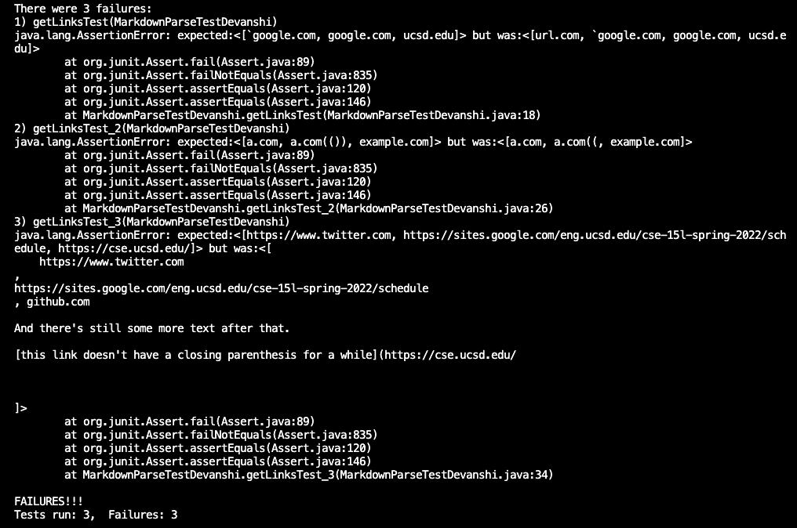

# Lab Report 4


Proceeded by adding three test methods in each MarkdownParse repository. 

1. Repository teamOne is a cloned repository corresponding to the collective github repository of our group : https://github.com/mv5903/markdown-parser
2. Repository teamTwo is the cloned repository of the group we reviewed : https://github.com/aHewig/markdown-parser

No, the corresponding output after running the JUnit test above, did not match the expected output, in our implementation.


No, the corresponding output after running the JUnit test above, did not match the expected output, in the implementation we reviewed .




## Snippet 1
```
`[a link`](url.com)

[another link](`google.com)`

[`cod[e`](google.com)

[`code]`](ucsd.edu)

```
After viewing the code through VScode preview, the valid links turn up in blue colored font, hence, making it clear, MarkdownParse.java's expected output is ```google.com```
```google.com``` ```ucsd.edu```
### JUnit test implementation in MarkdownParseTestDevanshi.java for Snippet 1.
```
@Test
public void getLinksTest() throws IOException{
    Path fileName = Path.of("labTest1.md");
    String content = Files.readString(fileName);
    List<String> result = List.of("google.com", "google.com", "ucsd.edu");
    assertEquals(result, MarkdownParse.getLinks(content));//(content)
}
```
Both programs for snippet 1 simply check the starting and ending of round parentheses i.e. ( ), however, to create a proper link in markdown, the syntax has to be of the form : square brackets followed by parentheses, where the square brackets hold the text, and the parentheses hold the link. (Reference : https://anvilproject.org/guides/content/creating-links). So, specifying the starting and ending of the square brackets in lines 50-55 should fix the error with Snippet-1.

## Snippet 2
```
[a [nested link](a.com)](b.com)

[a nested parenthesized url](a.com(()))

[some escaped \[ brackets \]](example.com)

```
After viewing the code through VScode preview, the valid links turn up in blue colored font, hence, making it clear, MarkdownParse.java's expected output is ```a.com```
```a.com(())```
```example.com```

### JUnit test implementation in MarkdownParseTestDevanshi.java for Snippet 2.
```
@Test
public void getLinksTest_2() throws IOException{
    Path fileName = Path.of("labTest2.md");
    String content = Files.readString(fileName);
    List<String> result = List.of("a.com", "a.com(())", "example.com");
    assertEquals(result, MarkdownParse.getLinks(content));//(content)
}
```
For snippet 2, both programs produce ```a.com((``` instead of ```a.com(())```. This is because they start the resultant link after the first occurence of ```(``` and ends at the first ```)``` no matter the number of ```(``` show up between them. Therefore to fix this error, we need to implement fixes to consider the end of the link only when all possible pairs of parentheses are completed. 

## Snippet 3
```
[this title text is really long and takes up more than 
one line

and has some line breaks](
    https://www.twitter.com
)

[this title text is really long and takes up more than 
one line](
https://sites.google.com/eng.ucsd.edu/cse-15l-spring-2022/schedule
)


[this link doesn't have a closing parenthesis](github.com

And there's still some more text after that.

[this link doesn't have a closing parenthesis for a while](https://cse.ucsd.edu/


)

And then there's more text
```

After viewing the code through VScode preview, the valid links turn up in blue colored font, hence, making it clear, MarkdownParse.java's expected output is ```https://www.twitter.com```
```https://sites.google.com/eng.ucsd.edu/cse-15l-spring-2022/schedule```
```https://cse.ucsd.edu/```

### JUnit test implementation in MarkdownParseTestDevanshi.java for Snippet 3.
```
@Test
public void getLinksTest_3() throws IOException{
    Path fileName = Path.of("labTest3.md");
    String content = Files.readString(fileName);
    List<String> result = List.of("https://www.twitter.com", "https://sites.google.com/eng.ucsd.edu/cse-15l-spring-2022/schedule", "https://cse.ucsd.edu/"); 
    assertEquals(result, MarkdownParse.getLinks(content));//(content)
}
```
In the first implementation, since all occurences of ```(``` and ```)``` occur in different lines that the link, the first program does not produce any links. To fix this error, we need to edit the code such that it includes all links which are within a single line with no spaces, no matter the parentheses being in different lines. 

For the second implementation (i.e. the one we reviwed), the first two expected products are equal to the links produced, but for the third link, the program returns all strings between the first occurence of ```(```  and the last occurence of ```)```. To fix that, we need to make sure there are no blank spaces within a link. Now, 


