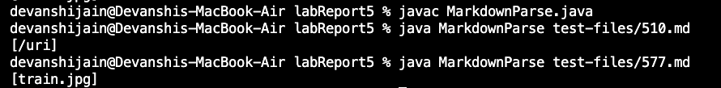
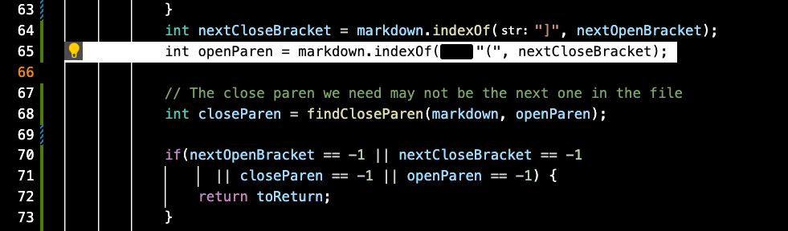
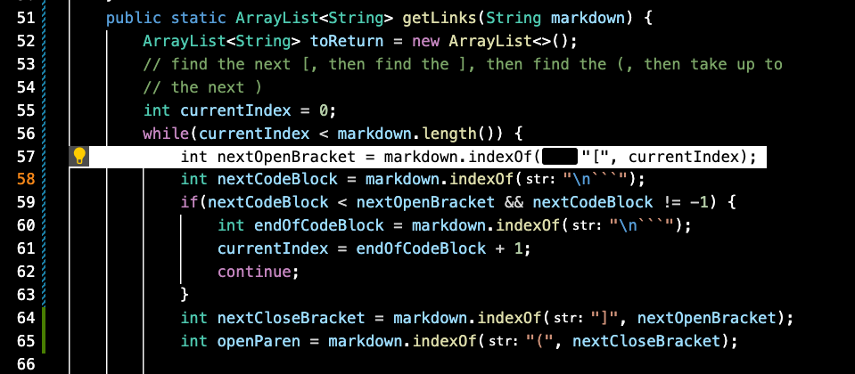

## Lab Report 5

Following are the two tests where implementations of MarkdownParse.java created by [our group](https://github.com/devanshi-jain/markdown-parser/blob/main/MarkdownParse.java), and [the one provided in the Lab Report](https://github.com/nidhidhamnani/markdown-parser/blob/main/MarkdownParse.java).
How you found the tests with different results 

Output via provided implementation of MarkdownPArse.java:


Link to Test 510 :  https://github.com/nidhidhamnani/markdown-parser/blob/main/test-files/184.md 
Expected Output : ```[]```
Group's output : ```[]```
Provided implementation's output : ```[/uri]```
Our group's implementation is correct. However, there is a bug in the provided implementation:
 

As we can see that in test 510, there is a space between the ```]``` and  ```(``` making the link invalid. It is not checking that ```]``` is immediately followed by a ```(```. To fix the bug, we need to add an if-statement to check this condition.

Link to Test 577 : https://github.com/nidhidhamnani/markdown-parser/blob/main/test-files/510.md
Expected Output : ```[]```
Group's output : ```[]```
Provided implementation's output : ```[train.jpg]```

Our group's implementation is correct. However, there is a bug in the provided implementation:

 

We see that Test 577 contains an image instead of a link, and the provided implementation fails to check for images since it fails to check for a ```!``` at the index before nextOpenBracket. It should instead be moved to the next one if one is found and must be updated.
